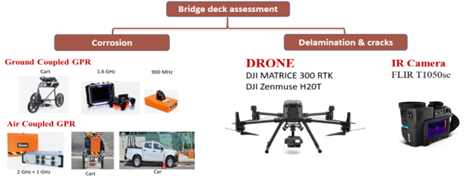

- **Funding Scheme: Smart Traffic Fund** 
- **Funding Amount: $8,099,567** 
- **Principal Investigator: Prof. ZAYED Tarek** 

## Introduction 
Hong Kong has 1,340 bridges, with 7% over 50 years old, and 40% over 30 years old, many of which are showing signs of aging. High temperatures (37.8ºC) and humidity (84%) accelerate rebar corrosion and concrete degradation, leading to cracks, spalling, and structural weakening. These challenges are compounded by Hong Kong’s dense urban environment, where inspections and repairs are logistically complex.  The socio-economic consequences became evident after a barge collided with the Kap-Shui-Mun Bridge in October 2015, halting operations at Hong Kong Airport and raising concerns about the bridge's structural integrity and future safety. This scenario underscores the critical necessity of developing reliable models for the smart efficiency and safety evaluations of bridge superstructures. 

## Project Scope 
In Hong Kong, like worldwide practice, visual inspection (VI) is the primary method to assess bridge condition. However, it often fails to detect subsurface defects, such as rebar corrosion. The Federal Highway Administration (FHWA) in the USA reported that 48% of bridge condition ratings using VI were incorrectly assessed. To overcome these limitations, this research integrated three advanced technologies: 
1. Visual Inspections (VI) enhanced by drones for automated data collection.
2. Ground-Penetrating Radar (GPR) to map subsurface corrosion.
3. Infrared Thermography (IR) to detect delamination (internal concrete separation).

Machine learning algorithms were utilized to analyse the combined data from these technologies, forming a comprehensive multi-tier inspection system designed to identify critical defects. The project aimed to: 
1. Pinpoint key factors and defect types driving bridge deterioration in Hong Kong’s unique climate.
2. Develop a multi-tier inspection system for detecting and locating surface and subsurface defects in concrete bridge decks.
3. Design a Bridge Deck Efficiency Index (BDEI) to quantify structural health. 

## Key Findings 
The project findings/deliverables can be summarized into the following points: 
1. **Deterioration Analysis Report**: Identified critical surface/subsurface defects (e.g., cracks, corrosion) and their severity in Hong Kong’s environment.
2. **Hybrid Inspection System**: A tested setup combining drones, GPR, and IR for efficient defect detection (Figure 1).
3. **Bridge Deck Efficiency Index (BDEI)**: A smart index integrating three metrics:
   - **Surface Defect Efficiency Assessment (SDEA)** for surface damage.
   - **GPR Corrosiveness Index (GCI)** for hidden rebar corrosion.
   - **IR Delamination Index (IDI)** for concrete delamination.
4. A **5-Point Severity Scale**: A standardized rating system to prioritize repairs.
5. **Smart Bridge Deck Efficiency (SBDE) Tool**: A user-friendly software prototype automating data analysis.

The multi-tier inspection system that integrates GPR and IRT was tested on 11 bridges, i.e., five were vehicle bridges and six were footbridges (Figure 2). The main focus was to detect three major defects: cracks, delamination, and corrosion, which are critical concerns for concrete structures. However, the system has the potential to extend its capabilities to detect other issues like spalling, scaling, and voids. 

